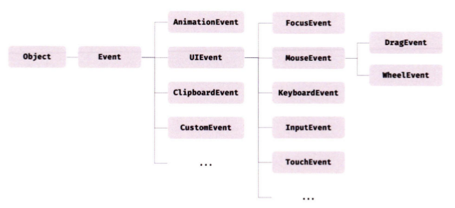
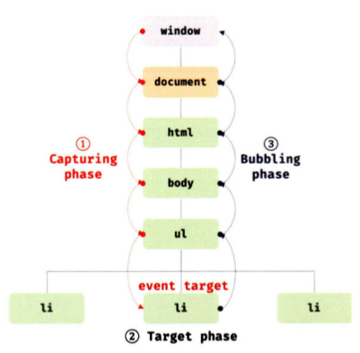

# 40장 이벤트

## 40.1 이벤트 드리븐 프로그래밍

브라우저는 처리할 사건이 발생하면 이를 감지해 이벤트를 발생시킨다. 클릭, 키보드 입력, 마우스 이동 등이 일어나면 브라우저는 이를 감지해 특정 타입의 이벤트를 발생시킨다.

이벤트가 발생했을 때 호출될 함수를 **이벤트 핸들러**라 하고, 이벤트 발생 시 브라우저에게 이벤트 핸들러의 호출을 위임하는 것을 이벤트 핸들러 등록이라 한다.

```js
const $button = document.querySelector("button");

// 사용자가 버튼을 클릭하면 함수를 호출하도록 요청
$button.onclick = () => {
  alert("button click");
};
```

`Window`, `Document`, `HTMLElement` 타입의 객체는 `onclick` 처럼 다양한 이벤트 핸들러 프로퍼티를 가지고 있다. 해당 이벤트 발생 시 할당한 함수가 브라우저에 의해 호출된다.

프로그램의 흐름을 이벤트 중심으로 제어하는 프로그래밍 방식을 이벤트 드리븐 프로그래밍이라 한다.

## 40.2 이벤트 타입

이벤트 타입은 이벤트의 종류를 나타내는 문자열이다. 이벤트 타입은 약 200여 가지가 있다. 아래는 자주 사용되는 이벤트를 정리해둔 표다.

### 마우스 이벤트

| 이벤트 타입 | 이벤트 발생 시점                                               |
| :---------- | :------------------------------------------------------------- |
| click       | 마우스 버튼을 클릭했을 때                                      |
| dblclick    | 마우스 버튼을 더블 클릭했을 때                                 |
| mousedown   | 마우스 버튼을 눌렀을 때                                        |
| mouseup     | 누르고 있던 마우스 버튼을 놓았을 때                            |
| mousemove   | 마우스 커서를 움직였을 때                                      |
| mouseenter  | 마우스 커서를 HTML 요소 안으로 이동했을 때 (버블링되지 않는다) |
| mouseover   | 마우스 커서를 HTML 요소 안으로 이동했을 때 (버블링된다)        |
| mouseleave  | 마우스 커서를 HTML 요소 밖으로 이동했을 때 (버블링되지 않는다) |
| mouseout    | 마우스 커서를 HTML 요소 밖으로 이동했을 때 (버블링된다)        |

### 키보드 이벤트

| 이벤트 타입 | 이벤트 발생 시점                                                                                                                                                                                                                                           |
| :---------- | :--------------------------------------------------------------------------------------------------------------------------------------------------------------------------------------------------------------------------------------------------------- |
| keydown     | 모든 키를 눌렀을 때 발생한다.<br>※ control, option, shift, tab, delete, enter, 방향 키와 문자, 숫자, 특수 문자 키를 눌렀을 때 발생한다. 단, 문자, 숫자, 특수 문자, enter 키를 눌렀을 때는 연속적으로 발생하지만 그 외의 키를 눌렀을 때는 한 번만 발생한다. |
| keypress    | 문자를 눌렀을 때 연속적으로 발생한다.<br>※ control, option, shift, tab, delete, 방향 키 등을 눌렀을 때는 발생하지 않고 문자, 숫자, 특수 문자, enter 키를 눌렀을 때만 발생한다. 폐지(deprecated)되었으므로 사용하지 않을 것을 권장한다.                     |
| keyup       | 누르고 있던 키를 놓았을 때 한 번만 발생한다.<br>※ keydown 이벤트와 마찬가지로 control, option, shift, tab, delete, enter, 방향 키와 문자, 숫자, 특수 문자 키를 놓았을 때 발생한다.                                                                         |

### 포커스 이벤트

| 이벤트 타입 | 이벤트 발생 시점                                   |
| :---------- | :------------------------------------------------- |
| focus       | HTML 요소가 포커스를 받았을 때 (버블링되지 않는다) |
| blur        | HTML 요소가 포커스를 잃었을 때 (버블링되지 않는다) |
| focusin     | HTML 요소가 포커스를 받았을 때 (버블링된다)        |
| focusout    | HTML 요소가 포커스를 잃었을 때 (버블링된다)        |

`focusin`, `focusout` 이벤트 핸들러를 이벤트 핸들러 프로퍼티 방식으로 등록하면 크롬, 사파리에서 정상 동작하지 않는다. `focusin`, `focusout` 이벤트 핸들러는 `addEventListener` 메서드 방식을 사용해 등록해야 한다.

### 폼 이벤트

| 이벤트 타입 | 이벤트 발생 시점                                                                                                                                                                                                                         |
| :---------- | :--------------------------------------------------------------------------------------------------------------------------------------------------------------------------------------------------------------------------------------- |
| submit      | 1. form 요소 내의 input(text, checkbox, radio), select 입력 필드(textarea 제외)에서 엔터 키를 눌렀을 때<br>2. form 요소 내의 submit 버튼(`<button>`, `<input type="submit">`)을 클릭했을 때<br>※ submit 이벤트는 form 요소에서 발생한다. |
| reset       | form 요소 내의 reset 버튼을 클릭했을 때 (최근에는 사용하지 않음)                                                                                                                                                                         |

### 값 변경 이벤트

| 이벤트 타입      | 이벤트 발생 시점                                                                                                                                                                                                                                                                                            |
| :--------------- | :---------------------------------------------------------------------------------------------------------------------------------------------------------------------------------------------------------------------------------------------------------------------------------------------------------- |
| input            | input(text, checkbox, radio), select, textarea 요소의 값이 입력되었을 때                                                                                                                                                                                                                                    |
| change           | input(text, checkbox, radio), select, textarea 요소의 값이 변경되었을 때<br>※ change 이벤트는 input 이벤트와 달리 HTML 요소가 포커스를 잃었을 때 사용자 입력이 종료되었다고 인식하여 발생한다. 즉, 사용자가 입력 중일 때는 input 이벤트가 발생하고, 입력이 완료되어 값이 변경되면 change 이벤트가 발생한다. |
| readystatechange | HTML 문서의 로드와 파싱 상태를 나타내는 document.readyState 프로퍼티 값('loading', 'interactive', 'complete')이 변경될 때                                                                                                                                                                                   |

### DOM 뮤테이션 이벤트

| 이벤트 타입      | 이벤트 발생 시점                                                |
| :--------------- | :-------------------------------------------------------------- |
| DOMContentLoaded | HTML 문서의 로드와 파싱이 완료되어 **DOM 생성이 완료**되었을 때 |

### 뷰 이벤트

| 이벤트 타입 | 이벤트 발생 시점                                                                                          |
| :---------- | :-------------------------------------------------------------------------------------------------------- |
| resize      | 브라우저 윈도우(window)의 크기를 리사이즈할 때 연속적으로 발생한다.<br>※ 오직 window 객체에서만 발생한다. |
| scroll      | 웹페이지(document) 또는 HTML 요소를 스크롤할 때 연속적으로 발생한다.                                      |

### 리소스 이벤트

| 이벤트 타입 | 이벤트 발생 시점                                                                                                       |
| :---------- | :--------------------------------------------------------------------------------------------------------------------- |
| load        | DOMContentLoaded 이벤트가 발생한 이후, 모든 리소스(이미지, 폰트 등)의 로딩이 완료되었을 때 (주로 window 객체에서 발생) |
| unload      | 리소스가 언로드될 때 (주로 새로운 웹페이지를 요청한 경우)                                                              |
| abort       | 리소스 로딩이 중단되었을 때                                                                                            |
| error       | 리소스 로딩이 실패했을 때                                                                                              |

### 자주 사용되는 이벤트 타입 요약본

| 이벤트 타입      | 발생 시점                                              | 버블링 여부       | 비고                    |
| :--------------- | :----------------------------------------------------- | :---------------- | :---------------------- |
| click            | 마우스 버튼을 클릭했을 때                              | O                 |                         |
| dblclick         | 마우스 버튼을 더블 클릭했을 때                         | O                 |                         |
| mousedown        | 마우스 버튼을 눌렀을 때                                | O                 |                         |
| mouseup          | 마우스 버튼을 놓았을 때                                | O                 |                         |
| mousemove        | 마우스 커서를 움직였을 때                              | O                 | 연속 발생               |
| mouseenter       | 커서가 요소 안으로 이동했을 때                         | ❌ (버블링 안 됨) |                         |
| mouseover        | 커서가 요소 안으로 이동했을 때                         | O                 |                         |
| mouseleave       | 커서가 요소 밖으로 이동했을 때                         | ❌ (버블링 안 됨) |                         |
| mouseout         | 커서가 요소 밖으로 이동했을 때                         | O                 |                         |
| keydown          | 키를 눌렀을 때                                         | O                 | 대부분 키에 대해 발생   |
| keypress         | 문자를 눌렀을 때 (폐지됨)                              | O                 | deprecated              |
| keyup            | 키를 놓았을 때                                         | O                 |                         |
| focus            | 요소가 포커스를 받았을 때                              | ❌ (버블링 안 됨) |                         |
| blur             | 요소가 포커스를 잃었을 때                              | ❌ (버블링 안 됨) |                         |
| focusin          | 요소가 포커스를 받았을 때                              | O                 |                         |
| focusout         | 요소가 포커스를 잃었을 때                              | O                 |                         |
| submit           | form에서 엔터 입력 또는 submit 버튼 클릭했을 때        | O                 | form 요소에서 발생      |
| reset            | form에서 reset 버튼 클릭했을 때                        | O                 | 거의 사용 안 함         |
| input            | 입력 중 (input, textarea 등)                           | O                 | 입력하는 동안 연속 발생 |
| change           | 입력 완료 후 값이 변경되었을 때                        | O                 | 포커스 아웃 후 발생     |
| readystatechange | document.readyState가 변할 때 ('loading' → 'complete') | O                 |                         |
| DOMContentLoaded | HTML 문서 파싱 완료 후 DOM 생성 완료                   | O                 | 리소스(이미지 등) 제외  |
| resize           | 브라우저 창 크기 변경할 때                             | O                 | window 객체에서만 발생  |
| scroll           | 문서나 요소를 스크롤할 때                              | O                 | 연속 발생               |
| load             | 모든 리소스(이미지 등) 로딩 완료                       | O                 | window 객체에 주로 발생 |
| unload           | 리소스가 언로드될 때                                   | O                 | 페이지 이동 시          |
| abort            | 리소스 로딩 중단 시                                    | O                 |                         |
| error            | 리소스 로딩 실패 시                                    | O                 |                         |

## 40.3 이벤트 핸들러 등록

이벤트 핸들러는 이벤트가 발생하면 브라우저에 의해 호출되는 함수를 말한다.

이벤트가 발생했을 때 브라우저에게 이벤트 핸들러의 호출을 위임하는 것을 핸들러 등록이라 하고, 등록 방법에는 3가지가 있다.

### 1. 이벤트 핸들러 속성 방식

HTML 요소 속성 중에는 이벤트에 대응하는 이벤트 핸들러 속성이 있다. `on` 접두사와 이벤트의 종류를 나타내는 이벤트 타입으로 이루어져 있다. 이벤트 핸들러 속성 값으로 함수 호출문 등의 문을 할당하면 이벤트 핸들러가 등록된다.

⚠️이벤트 핸들러 속성 값으로 함수 참조가 아닌 함수 호출문 등의 문을 할당하는 점에서 주의가 필요하다.

**이벤트 핸들러 속성 값은 암묵적으로 이벤트 핸들러의 함수 몸체를 의미한다.** 이처럼 설계된 이유는 이벤트 핸들러에 인수를 전달하기 위함이다. 함수 참조만으로는 인수를 전달하기 곤란하기 때문이다. 따라서, 여러 개의 문을 할당하는 것도 가능하다.

```html
<button onclick="sayHi('Lee')">Click me!</button>
<!-- 이벤트 핸들러 속성 값은 다음과 같이 파싱된다. -->
<script>
  function onclick(event) {
    sayHi("Lee");
  }
</script>
```

HTML과 자바스크립트의 관심사를 분리하는 관점에서는 권장되지 않는 사용 방식이다. 하지만, 컴포넌트 기반 개발론(CBD)에서는 이벤트 핸들러 속성 방식으로 이벤트를 처리한다. CBD는 HTML, CSS, JS를 뷰를 구성하기 위한 구성 요소로 보기 때문에 관심사가 다르다고 생각하지 않기 때문이다.

### 2. 이벤트 핸들러 프로퍼티 방식

`window` 객체, `Document`, `HTMLElement` 타입의 DOM 노드 객체는 이벤트에 대응하는 이벤트 핸들러 프로퍼티를 가진다. `on` 접두사와 이벤트 종류를 나타내는 이벤트 타입으로 이루어져 있다. 이 프로퍼티에 함수를 바인딩하면 이벤트 핸들러를 등록할 수 있다.

```js
const $button = document.querySelector("button");

$button.onclick = function () {
  console.log("button clicked");
};
/**
 * $button == 이벤트 타깃
 * onclick == on + 이벤트 타입
 * function == 이벤트 핸들러
 */
```

이벤트 핸들러를 등록하려면 이벤트를 발생시키는 객체인 **이벤트 타깃**과 이벤트의 종류를 나타내는 문자열인 **이벤트 타입** 그리고 **이벤트 핸들러**를 지정할 필요가 있다.

이벤트 핸들러 속성 방식도 결국 이벤트 핸들러 프로퍼티로 변환되므로 프로퍼티 방식과 동일하다고 할 수 있다.

HTML과 자바스크립트로 관심사를 분리할 수 있지만, 프로퍼티 하나 당 하나의 이벤트 핸들러만 바인딩할 수 있다는 단점이 있다. 중복해서 바인딩할 경우, 이전에 바인딩된 이벤트 핸들러는 무시된다.

### 3. `addEventListener` 메서드 방식

DOM Level 2에서 도입된 `EventTarget.prototype.addEventListener` 메서드를 사용해 이벤트 핸들러를 등록할 수 있다. 앞서 살펴본 이벤트 핸들러 속성 방식이나 이벤트 핸들러 프로퍼티 방식은 DOM Level 0부터 제공되던 방식이다.

`EventTarget.addEventListener('evenType', functionName [, useCapture])`

첫 번째 매개변수에는 이벤트 타입을 전달한다. 이때 `on` 접두사는 붙이지 않는다. 두 번째 매개변수에는 이벤트 핸들러를 전달한다. 마지막 매개변수에는 이벤트를 캐치할 이벤트 전파 단계(캡처링 또는 버블링)를 지정한다. 생략하거나 `false`를 지정하면 버블링 단계에서 이벤트를 캐치하고 `true`를 지정하면 캡처링 단계에서 이벤트를 캐치한다.

```js
const $button = document.querySelector("button");

$button.addEventListener("click", function () {
  console.log("button click");
});
/**
 * $button == 이벤트 타깃
 */
```

`addEventListener` 메서드 방식은 이벤트 핸들러 프로퍼티에 바인딩된 이벤트 핸들러에 영향을 주지 않는다! 따라서 두 가지 방식으로 동시에 바인딩하면 두 가지 이벤트 핸들러가 모두 호출된다.

`addEventListener` 메서드 방식은 하나 이상의 이벤트 핸들러를 등록할 수 있다. 이때 이벤트 핸들러는 등록된 순서대로 호출된다. 참조가 동일한 이벤트 핸들러는 두 번 선언해도 하나만 등록된다.

## 40.4 이벤트 핸들러 제거

`addEventListener` 메서드로 등록한 이벤트 핸들러를 제거하려면 `EventTarget.prototype.removeEventListener` 메서드를 사용한다. 해당 메서드에는 `addEventListener` 메서드와 동일하게 인수를 전달한다. 전달한 인수가 서로 일치하지 않으면 제거되지 않는다. (세 번째 매개변수도 일치해야 함.)

무명 함수로 등록한 경우, 이벤트 핸들러를 제거할 수 없다.

단, 기명 이벤트 핸들러 내부에서 `removeEventListener` 메서드를 호출하여 이벤트 핸들러를 제거할 수는 있다. 이때 이벤트 핸들러는 단 한 번만 호출된다.

기명 함수를 이벤트 핸들러로 등록할 수 없다면, 함수 자신을 가리키는 `argument.callee`를 사용할 수도 있다. 최적화를 방해하므로 strict mode에서 사용이 금지된다. 가급적 핸들러의 참조를 변수나 자료구조에 저장하여 제거하는 편이 좋다.

이벤트 핸들러 프로퍼티 방식으로 등록한 이벤트 핸들러는 `removeEventListener` 메서드로 제거할 수 없다. 제거하려면 프로퍼티에 `null`을 할당한다.

## 40.5 이벤트 객체

이벤트가 발생하면 이벤트에 관련한 다양한 정보를 담고 있는 이벤트 객체가 동적으로 생성된다. **생성된 이벤트 객체는 이벤트 핸들러의 첫 번째 인수로 전달된다.**

```js
const $msg = document.querySelector(".message");

// 클릭 이벤트에 의해 생성된 이벤트 객체는 이벤트 핸들러의 첫 번째 인수로 전달된다.
function showCoords(e) {
  $msg.textContent = `clientX: ${e.clientX}, clientY: ${e.clientY}`;
}

document.onclick = showCoords;
```

이벤트 객체가 `e`에 암묵적으로 할당된다. 이는 브라우저가 이벤트 핸들러를 호출할 때 이벤트 객체를 인수로 전달하기 때문이다. 이벤트 객체를 전달받으려면 이벤트 핸들러를 정의할 때 이벤트 객체를 전달받을 매개변수를 명시적으로 선언해야 한다. `e`말고 다른 이름도 상관없다.

이벤트 핸들러 속성 방식의 경우 이름이 반드시 `event`여야 한다. 암묵적으로 생성된 `on` 접두사 + 이벤트 타입의 이벤트 핸들러의 첫 번째 매개변수 이름이 `event`로 암묵적으로 명명되기 때문이다.

### 이벤트 객체의 상속 구조



`Event`, `UIEvent`, `MouseEvent` 등 모두는 생성자 함수다. 따라서 생성자 함수로 이벤트 객체를 생성할 수 있다.

이벤트가 발생하면 암묵적으로 생성되는 이벤트 객체도 생성자 함수에 의해 생성된다. 그리고 생성된 이벤트 객체는 생성자 함수와 더불어 생성되는 프로토타입으로 구성된 프로토타입 체인의 일원이 된다. `click` 이벤트가 발생하면 암묵적으로 생성되는 `MouseEvent` 타입의 이벤트 객체는 `Object` -> `Event` -> `UIEvent` -> `MouseEvent` 체인의 일원이다.

이벤트 객체는 사용자 행위에 의해 생성되거나 자바스크립트 코드에 의해 인위적으로 생성될 수 있다.

`CustomEvent` 타입의 이벤트 객체는 자바스크립트 코드에 의해 인위적으로 생성한 이벤트 객체다.

`Event` 인터페이스에는 모든 이벤트 객체의 공통 프로퍼티가, 하위 이벤트 인터페이스에는 고유한 프로퍼티가 정의되어 있다.

### 이벤트 객체의 공통 프로퍼티

`Event` 인터페이스의 이벤트 객체 공통 프로퍼티는 다음과 같다.

<!-- prettier-ignore-start -->
| 공통 프로퍼티      | 설명 | 타입 |
|:-----------------|:-----|:-----|
| type             | 이벤트 타입 | string |
| target           | 이벤트를 발생시킨 DOM 요소 | DOM 요소 노드 |
| currentTarget    | 이벤트 핸들러가 바인딩된 DOM 요소 | DOM 요소 노드 |
| eventPhase       | 이벤트 전파 단계 (0: 없음, 1: 캡처링, 2: 타깃, 3: 버블링) | number |
| bubbles          | 이벤트가 버블링되는지 여부<br>※ focus/blur, load/unload/abort/error, mouseenter/mouseleave는 false | boolean |
| cancelable       | preventDefault 호출로 기본 동작을 취소할 수 있는지 여부<br>※ focus/blur, load/unload/abort/error는 false | boolean |
| defaultPrevented | preventDefault 호출 여부 | boolean |
| isTrusted        | 사용자 행위로 발생한 이벤트인지 여부<br>dispatchEvent로 인위적 생성한 이벤트면 false | boolean |
| timeStamp        | 이벤트 발생 시각(1970/01/01/00:00:00부터 경과한 밀리초) | number |
<!-- prettier-ignore-end -->

### 마우스 정보 취득

`MouseEvent` 타입의 이벤트 객체는 마우스 포인터의 좌표 정보를 나타내는 고유의 프로퍼티, 버튼 정보를 나타내는 고유의 프로퍼티를 갖는다.

> 마우스 포인터 좌표 정보 프로퍼티
>
> - screenX : 모니터 화면 전체 기준
> - clientX : 현재 브라우저 화면 기준
> - pageX : 문서(Document) 전체 기준
> - offsetX : 이벤트 발생 요소(Element) 기준

DOM 요소를 마우스로 드래그해 이동하는 예제는 다음과 같다.

드래그는 `mousedown` 이벤트가 발생한 상태에서 `mousemove` 이벤트 발생한 시점에 시작하고, `mouseup` 이벤트가 발생한 시점에 종료된다.

```js
// 드래그 대상 요소
const $box = document.querySelector(".box");

// 드래그 시작 시점의 마우스 포인터 위치
const initialMousePos = { x: 0, y: 0 };
// 오프셋: 이동할 거리
const offset = { x: 0, y: 0 };

// mousemove 이벤트 핸들러
const move = (e) => {
  // 오프셋 = 현재(드래그하고 있는 시점) 마우스 포인터 위치 - 드래그 시작 시점의 마우스 포인터 위치
  offset.x = e.clientX - initialMousePos.x;
  offset.y = e.clientY - initialMousePos.y;

  // translate3d는 GPU를 사용하므로 absolute의 top, left를 사용하는 것보다 빠르다.
  // top, left는 레이아웃에 영향을 준다.
  $box.style.transform = `translate3d(${offset.x}px, ${offset.y}px, 0)`;
};

// mousedown 이벤트가 발생하면 드래그 시작 시점의 마우스 포인터 좌표를 저장한다.
$box.addEventListener("mousedown", (e) => {
  // 이동 거리를 계산하기 위해 mousedown 이벤트가 발생(드래그를 시작)하면
  // 드래그 시작 시점의 마우스 포인터 좌표(e.clientX/e.clientY: 뷰포트 상에서 현재
  // 마우스의 포인터 좌표)를 저장해 둔다. 한번 이상 드래그로 이동한 경우 move에서
  // translate3d(${offset.x}px, ${offset.y}px, 0)으로 이동한 상태이므로
  // offset.x와 offset.y를 빼주어야 한다.
  initialMousePos.x = e.clientX - offset.x;
  initialMousePos.y = e.clientY - offset.y;

  // mousedown 이벤트가 발생한 상태에서 mousemove 이벤트가 발생하면
  // box 요소를 이동시킨다.
  document.addEventListener("mousemove", move);
});

// mouseup 이벤트가 발생하면 mousemove 이벤트를 제거해 이동을 멈춘다.
document.addEventListener("mouseup", () => {
  document.removeEventListener("mousemove", move);
});
```

### 키보드 정보 취득

`keydown`, `keyup`, `keypress` 이벤트 발생 시 생성되는 `KeyboardEvent` 타입의 이벤트 객체는 `altKey`, `ctrlKey`, `shiftKey`, `metakey`, `key`, `keyCode` 등의 고유의 프로퍼티를 갖는다. (`keycode`는 폐지되었으며 대신 `key`를 사용)

`input` 입력 필드에 엔터를 입력하면 지금까지 입력된 값을 출력하는 예제는 다음과 같다.

```js
const $input = document.querySelector("input[type=text]");
const $msg = document.querySelector(".message");

$input.onkeyup = (e) => {
  // e.key는 입력한 키 값을 문자열로 반환한다.
  // 입력한 키가 'Enter', 즉 엔터 키가 아니면 무시한다.
  if (e.key !== "Enter") return;

  // 엔터키가 입력되면 현재까지 입력 필드에 입력된 값을 출력한다.
  $msg.textContent = e.target.value;
  e.target.value = "";
};
```

`key` 프로퍼티는 입력한 키 값을 문자열로 반환한다.

> 한글은 `keyup` 엔터 키 입력 시 이벤트 핸들러가 두 번 호출되는 현상이 발생한다. 이는 브라우저의 한글 입력이 조합(Composition) 과정을 거치기 때문이다. 조합 완료 시 한 번, 엔터 키 입력 시 한 번 호출된다.

## 40.6 이벤트 전파

DOM 요소 노드에서 발생한 이벤트는 DOM 트리를 통해 전파된다. 이를 이벤트 전파(event propagation)라고 한다.



1. 캡처링 단계: 이벤트가 상위 요소에서 하위 요소 방향으로 전파
2. 타깃 단계: 이벤트가 이벤트 타깃에 도달
3. 버블링 단계: 이벤트가 하위 요소에서 상위 요소 방향으로 전파

```html
<!DOCTYPE html>
<html>
  <body>
    <ul id="fruits">
      <li id="apple">Apple</li>
      <li id="banana">Banana</li>
      <li id="orange">Orange</li>
    </ul>
    <script>
      const $fruits = document.getElementById("fruits");

      // #fruits 요소의 하위 요소인 li 요소를 클릭한 경우
      $fruits.addEventListener("click", (e) => {
        console.log(`이벤트 단계: ${e.eventPhase}`); // 3: 버블링 단계
        console.log(`이벤트 타깃: ${e.target}`); // [object HTMLLIElement]
        console.log(`커런트 타깃: ${e.currentTarget}`); // [object HTMLUListElement]
      });
    </script>
  </body>
</html>
```

`li` 태그를 클릭하면

1. 클릭 이벤트 객체는 `window`에서 시작해 이벤트 타깃으로 전파(캡처링 단계)
2. 이벤트 객체가 이벤트를 발생시킨 이벤트 타깃에 도달(타깃 단계)
3. 이벤트 객체가 `window` 방향으로 전파(버블링 단계)

이벤트 핸들러 속성/프로퍼티 방식으로 등록한 이벤트 핸들러는 타깃 단계와 버블링 단계의 이벤트만 캐치할 수 있다.

그러나 `addEventListener` 메서드 방식으로 등록한 이벤트 핸들러는 타깃 단계, 버블링 단계, 캡처링 단계의 이벤트도 선별적으로 캐치할 수 있다. **캡처링 단계의 이벤트를 캐치하려면 메서드의 세 번째 인수로 `true`를 전달하면 된다.** 그렇지 않으면 타깃 단계, 버블링 단계만 캐치한다.

이벤트는 이벤트를 발생시킨 이벤트 타깃은 물론 상위 DOM 요소에서도 캐치할 수 있다.

대부분의 이벤트는 캡처링과 버블링을 통해 전파된다. 하지만 버블링을 통해 전파되지 않는 이벤트도 있다. `event.bubbles`의 값이 모두 `false`다.

- 포커스 이벤트: `focus`/`blur`
- 리소스 이벤트: `load`/`unload`/`abort`/`error`
- 마우스 이벤트: `mouseenter`/`mouseleave`

버블링되지 않는다면 캡처링에서 캐치해야 할 것이다. 하지만 `focusin`/`focusout`, `mouseover`/`mouseout`은 버블링되므로 이 이벤트로 대체할 수도 있다. 그러므로 캡처링 단계에서 이벤트를 캐치해야 할 경우는 거의 없다.

```html
<!DOCTYPE html>
<html>
<head>
  <style>
    html, body { height: 100%; }
  </style>
<body>
  <p>버블링과 캡처링 이벤트 <button>버튼</button></p>
  <script>
    // 버블링 단계의 이벤트를 캐치
    document.body.addEventListener('click', () => {
      console.log('Handler for body.');
    });

    // 캡처링 단계의 이벤트를 캐치
    document.querySelector('p').addEventListener('click', () => {
      console.log('Handler for paragraph.');
    }, true);

    // 타깃 단계의 이벤트를 캐치
    document.querySelector('button').addEventListener('click', () => {
      console.log('Handler for button.');
    });
  </script>
</body>
</html>
```

버튼을 클릭하면 이벤트 전파 단계에 따라,

```text
Handler for paragraph.
Handler for button.
Handler for body.
```

순서로 호출된다.

`p` 태그를 클릭하면,

```text
Handler for paragraph.
Handler for body.
```

## 40.7 이벤트 위임

`li` 태그를 클릭해 선택하면 현재 선택된 아이템에 `active` 클래스를 추가하고 그 외 아이템의 `active` 클래스는 제거하는 예제를 생각해보자.

모든 아이템이 클릭 이벤트에 반응하도록 모든 요소에 이벤트 핸들러를 등록할 수도 있다. 하지만 이는 성능 저하의 원인이 되며 유지보수에도 부적합한 코드를 생산하게 한다.

이벤트 위임(event delegation)은 **여러 개의 하위 DOM 요소에 각각 이벤트 핸들러를 등록하는 대신 하나의 상위 DOM 요소에 이벤트 핸들러를 등록하는 방법**이다.

상위 DOM 요소에 이벤트 핸들러를 등록하면 여러 개의 하위 DOM 요소에 이벤트 핸들러를 등록하지 않아도 된다.

```js
const $fruits = document.getElementById("fruits");
const $msg = document.querySelector(".msg");

// 사용자 클릭에 의해 선택된 내비게이션 아이템(li 요소)에 active 클래스를 추가하고
// 그 외의 모든 내비게이션 아이템의 active 클래스를 제거한다.
function activate({ target }) {
  // 이벤트를 발생시킨 요소(target)가 ul#fruits의 자식 요소가 아니라면 무시한다.
  if (!target.matches("#fruits > li")) return;

  [...$fruits.children].forEach(($fruit) => {
    $fruit.classList.toggle("active", $fruit === target);
    $msg.textContent = target.id;
  });
}

// 이벤트 위임: 상위 요소(ul#fruits)는 하위 요소의 이벤트를 캐치할 수 있다.
$fruits.onclick = activate;
```

이벤트 위임을 통해 하위 DOM 요소에서 발생한 이벤트를 처리할 때 주의점은 상위 요소에 이벤트 핸들러를 등록하기 때문에 이벤트 타깃, 즉 이벤트를 실제로 발생시킨 DOM 요소가 개발자가 기대한 DOM 요소가 아닐 수 있다는 것이다. 때문에 이벤트 반응이 필요한 DOM 요소(`#fruits > li` 선택자에 의해 선택되는 DOM 요소)에 한정하여 이벤트 핸들러가 실행되도록 이벤트 타깃을 검사할 필요가 있다.

이벤트 객체의 `target` 프로퍼티와 `currentTarget` 프로퍼티는 동일한 DOM 요소를 가리키지만 이벤트 위임을 통해 상위 DOM 요소에 바인딩한 경우 이벤트 객체의 `target` 프로퍼티와 `currentTarget` 프로퍼티가 다른 DOM 요소를 가리킬 수 있다.

## 40.8 DOM 요소의 기본 동작 조작

### DOM 요소의 기본 동작 중단

DOM 요소는 기본 동작을 갖는다. `a` 요소는 클릭 시 `href` 속성에 지정된 링크로 이동하고, `checkbox` 또는 `radio` 요소를 클릭하면 체크 또는 해제된다.

이벤트 객체의 `preventDefault` 메서드는 이러한 DOM 요소의 기본 동작을 중단시킨다.

### 이벤트 전파 방지

이벤트 객체의 `stopPropagation` 메서드는 이벤트 전파를 중지시킨다. 이는 상위 DOM 요소까지 이벤트가 전파되지 않게 하여 하위 DOM 요소의 이벤트를 개별적으로 처리하기 위함이다.

## 40.9 이벤트 핸들러 내부의 `this`

### 이벤트 핸들러 속성 방식

일반 함수로서 호출되는 함수 내부의 `this`는 전역 객체를 가리키므로, 이벤트 핸들러로 전달된 함수 내부의 `this`는 `window`를 가리킨다.

단, 이벤트 핸들러를 호출할 때 인수로 전달한 `this`는 이벤트를 바인딩한 DOM 요소를 가리킨다.

```html
<!DOCTYPE html>
<html>
  <body>
    <button onclick="handleClick(this)">Click me</button>
    <script>
      function handleClick(button) {
        console.log(button); // 이벤트를 바인딩한 button 요소
        console.log(this); // window
      }
    </script>
  </body>
</html>
```

### 이벤트 핸들러 프로퍼티 방식과 `addEventListener` 메서드 방식

두 방식 모두 이벤트 핸들러 내부의 `this`는 이벤트를 바인딩한 DOM 요소를 가리킨다. 즉, 이벤트 핸들러 내부의 `this`는 이벤트 객체의 `currentTarget` 프로퍼티와 같다.

화살표 함수는 함수 자체의 `this` 바인딩이 없으므로 화살표 함수로 정의한 이벤트 핸들러 내부의 `this`는 상위 스코프의 `this`를 가리킨다.

클래스에서 이벤트 핸들러를 사용할 땐, `this`가 인스턴스가 아닌 DOM 요소를 가리키는 것에 주의해야 한다. 생성자 함수에서 `bind` 메서드를 통해 `this`를 전달해 메서드 내부의 `this`가 클래스가 생성할 인스턴스를 가리키도록 해야 한다.

```html
<!DOCTYPE html>
<html>
  <body>
    <button class="btn">0</button>
    <script>
      class App {
        constructor() {
          this.$button = document.querySelector(".btn");
          this.count = 0;

          // increase 메서드를 이벤트 핸들러로 등록
          // this.$button.onclick = this.increase;

          // increase 메서드 내부의 this가 인스턴스를 가리키도록 한다.
          this.$button.onclick = this.increase.bind(this);
        }

        increase() {
          this.$button.textContent = ++this.count;
        }
      }

      new App();
    </script>
  </body>
</html>
```

또한 클래스 필드에 할당한 화살표 함수를 이벤트 핸들러로 등록할 수도 있다.

```js
increase = () => (this.$button.textContent = ++this.count);
```

## 40.10 이벤트 핸들러에 인수 전달

이벤트 핸들러 프로퍼티 방식과 `addEventListener` 메서드 방식은 다음 예제와 같이 이벤트 핸들러 내부에서 함수를 호출하면서 인수를 전달할 수 있다.

```html
<!DOCTYPE html>
<html>
  <body>
    <label>User name <input type="text" /></label>
    <em class="message"></em>
    <script>
      const MIN_USER_NAME_LENGTH = 5; // 이름 최소 길이
      const $input = document.querySelector("input[type=text]");
      const $msg = document.querySelector(".message");

      const checkUserNameLength = (min) => {
        $msg.textContent =
          $input.value.length < min ? `이름은 ${min}자 이상 입력해 주세요` : "";
      };

      // 이벤트 핸들러 내부에서 함수를 호출하면서 인수를 전달한다.
      $input.onblur = () => {
        checkUserNameLength(MIN_USER_NAME_LENGTH);
      };
    </script>
  </body>
</html>
```

또는 이벤트 핸들러를 반환하는 함수를 호출하면서 인수를 전달할 수 있다.

```js
// 이벤트 핸들러를 반환하는 함수
const checkUserNameLength = (min) => (e) => {
  $msg.textContent =
    $input.value.length < min ? `이름은 ${min}자 이상 입력해 주세요` : "";
};

// 이벤트 핸들러를 반환하는 함수를 호출하면서 인수를 전달한다.
$input.onblur = checkUserNameLength(MIN_USER_NAME_LENGTH);
```

## 40.11 커스텀 이벤트

### 커스텀 이벤트 생성

기존 이벤트 타입이 아닌 임의의 문자열을 사용하여 새로운 이벤트 타입을 지정할 수 있다. `CustomEvent` 이벤트 생성자 함수를 사용한다.

커스텀 이벤트 객체는 버블링되지 않으며 `preventDefault` 메서드로 취소할 수도 있다. (`bubbles`와 `cancelable` 프로퍼티 디폴트 값이 `false`)

커스텀 이벤트 객체에는 공통 프로퍼티나 이벤트 타입에 따른 고유의 프로퍼티 값을 지정해줄 수 있다.

```js
// MouseEvent 생성자 함수로 click 이벤트 타입의 커스텀 이벤트 객체를 생성
const mouseEvent = new MouseEvent("click", {
  bubbles: true,
  cancelable: true,
  clientX: 50,
  clientY: 100,
});

// KeyboardEvent 생성자 함수로 keyup 이벤트 타입의 커스텀 이벤트 객체를 생성
const keyboardEvent = new KeyboardEvent("keyup", { key: "Enter" });
```

### 커스텀 이벤트 디스패치

생성된 커스텀 이벤트는 `dispatchEvent` 메서드로 디스패치(이벤트를 발생시키는 행위)할 수 있다. `dispatchEvent` 메서드에 이벤트 객체를 인수로 전달하면서 호출하면 인수로 전달한 이벤트 타입의 이벤트가 발생한다.

일반적인 이벤트 핸들러는 비동기 처리 방식으로 동작하지만, `dispatchEvent` 메서드는 동기 처리 방식으로 호출한다.

```html
<!DOCTYPE html>
<html>
  <body>
    <button class="btn">Click me</button>
    <script>
      const $button = document.querySelector(".btn");

      // 버튼 요소에 foo 커스텀 이벤트 핸들러를 등록
      // 커스텀 이벤트를 디스패치하기 이전에 이벤트 핸들러를 등록해야 한다.
      $button.addEventListener("foo", (e) => {
        // e.detail에는 CustomEvent 함수의 두 번째 인수로 전달한 정보가 담겨 있다.
        alert(e.detail.message);
      });

      // CustomEvent 생성자 함수로 foo 이벤트 타입의 커스텀 이벤트 객체를 생성
      const customEvent = new CustomEvent("foo", {
        detail: { message: "Hello" }, // 이벤트와 함께 전달하고 싶은 정보
      });

      // 커스텀 이벤트 디스패치
      $button.dispatchEvent(customEvent);
    </script>
  </body>
</html>
```

임의의 이벤트 타입을 지정해 커스텀 이벤트 객체를 생성한 경우 반드시 `addEventListener` 메서드 방식으로 이벤트 핸들러를 등록해야 한다. `on` + 이벤트 타입의 이벤트 핸들러 속성/프로퍼티가 요소 노드에 존재하지 않기 때문에, 이벤트 핸들러 속성/프로퍼티 방식을 사용할 수 없다. 예를 들어, `'foo'`라는 임의의 이벤트 타입에 대응하는 `onfoo`라는 핸들러 속성/프로퍼티가 요소 노드에 존재하지 않기 때문이다.
