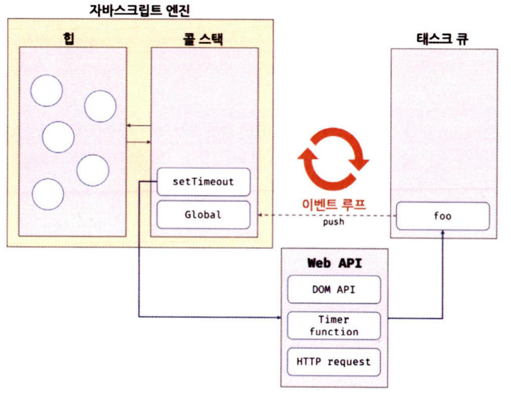

# 42장 비동기 프로그래밍

## 42.1 동기 처리와 비동기 처리

자바스크립트 엔진은 단 하나의 실행 컨텍스트 스택을 갖는다. 이는 동시에 2개 이상의 함수를 실행할 수 없다는 것을 의미한다. 자바스크립트는 싱글 스레드 방식이다.

싱글 스레드 방식은 태스크 처리에 시간이 오래 걸리는 경우 블로킹이 발생한다. 현재 처리중인 태스크가 종료될 때까지 다음 태스크가 대기하는 방식을 **동기 처리**라고 한다.

반면 현재 실행 중인 태스크가 종료되지 않아도 다음 태스크를 실행하는 방식을 **비동기 처리**라고 한다.

비동기 함수는 전통적으로 콜백 패턴을 사용한다. 이는 콜백 헬을 발생시켜 가독성을 나쁘게 하고, 처리 중 발생한 예외 처리가 곤란하며, 여러 개의 비동기 처리를 한 번에 처리하는 데도 한계가 있다. 이는 프로미스로 어느 정도 해결할 수 있다.

타이머 함수, HTTP 요청, 이벤트 핸들러는 비동기 처리 방식으로 동작한다.

## 42.2 이벤트 루프와 태스크 큐

자바스크립트는 싱글 스레드지만 브라우저의 동작을 보면 여러 태스크가 동시에 처리되는 것처럼 느껴진다.

자바스크립트의 동시성(concurrency)를 지원하는 것이 이벤트 루프다. 이벤트 루프는 브라우저 내장 기능 중 하나다.

대부분의 자바스크립트 엔진은 크게 2개 영역으로 구분할 수 있다.

- **콜 스택(call stack)**: 실행 컨텍스트 스택이다.
- **힙(heap)**: 객체가 저장되는 메모리 공간이다. 실행 컨텍스트는 힙에 저장된 객체를 참조한다.

비동기 처리는 자바스크립트 엔진 구동 환경인 브라우저나 Node.js가 담당한다.

- **태스크 큐(task queue/event queue/callback queue)**: 비동기 함수의 콜백 함수나 이벤트 핸들러가 일시적으로 보관되는 영역이다. 마이크로태스크 큐에는 프로미스의 후속 처리 메서드의 콜백 함수가 보관된다.
- **이벤트 루프**: 콜 스택에 현재 실행 중인 실행 컨텍스트가 있는지, 태스크 큐에 대깆 중인 함수가 있는지 반복해서 확인한다. 콜 스택이 비어 있고 태스크 큐에 대기 중인 함수가 있으면 이벤트 루프가 FIFO로 태스크 큐에 대기 중인 함수를 콜 스택으로 이동시킨다.

⚠️자바스크립트는 싱글 스레드 방식이지만 이렇게 동작하는 건 브라우저가 아니라 브라우저에 내장된 자바스크립트 엔진이다. 브라우저는 멀티 스레드로 동작한다.

콜백 함수를 타이머 설정과 타이머 만료 시 콜백 함수를 태스크 큐에 등록하는 처리는 브라우저가 실행한다. 동시에 실행 컨텍스트를 생성하고 콜 스택에 푸시하는 등의 처리는 자바스크립트 엔진이 실행한다.
